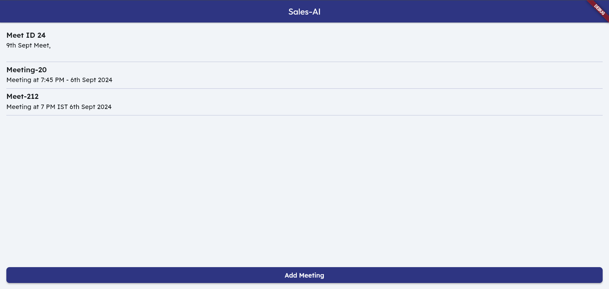
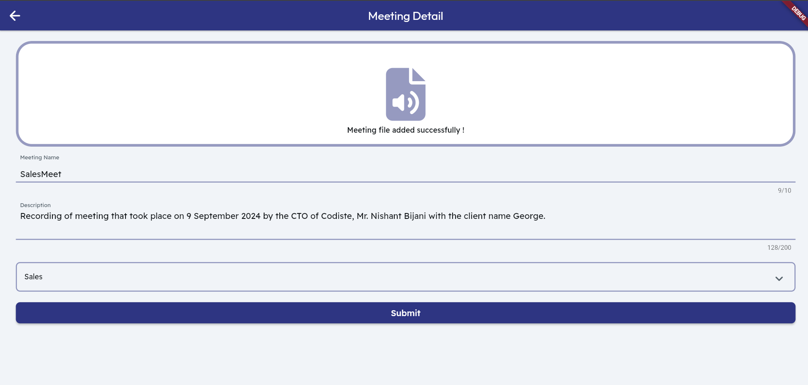
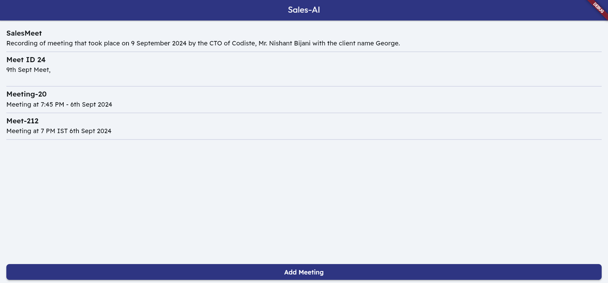
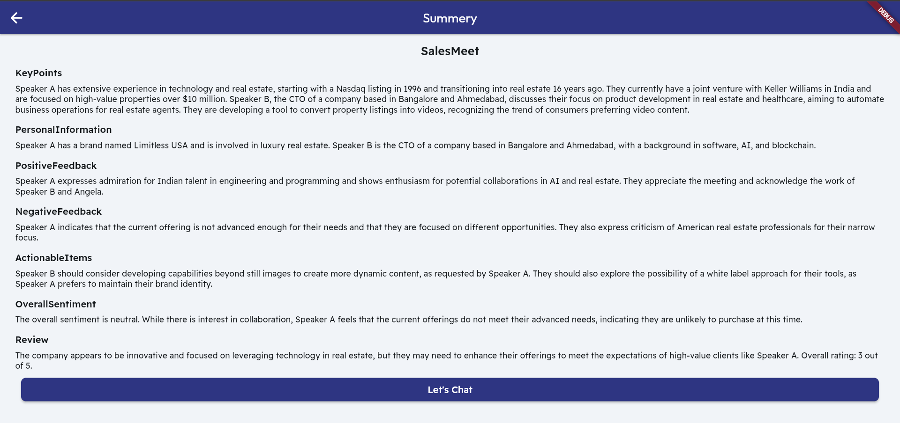
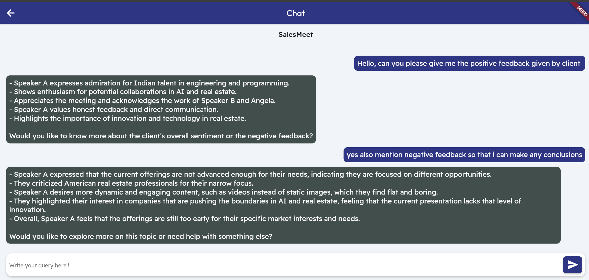

## SalesAI

### Overview
This project is designed to extract and present key insights from meeting recordings, including **sales**, **credit card inquiries**, and **recovery calls**. Using **FastAPI** for the backend, it allows users to upload audio files and automatically generate summaries with actionable key points, responding to natural language queries. This helps sales teams make informed decisions.
The **Flutter-based frontend** provides an intuitive interface for users to upload recordings and view summaries, ensuring a seamless experience across devices for better sales outcomes.

### Key Features

#### 1. Addressing Diverse Industry Challenges
The platform is designed to tackle a range of industry-specific problems, including:
- **Cold calling in sales**
- **Credit card inquiries**
- **Loan recovery processes**

By providing targeted insights and solutions, it helps professionals navigate these unique challenges more effectively and improve overall outcomes.

#### 2. Meeting Summarization
The platform captures essential points, decisions, and action items, providing a clear and actionable overview of the meeting's content. This enhances productivity by allowing users to quickly review and access critical details without manually sifting through lengthy recordings.

#### 3. Analytical Data Extraction
It systematically extracts valuable insights from conversation transcripts, such as:
- **Customer backgrounds**
- **Budget information**
- **Other relevant data**

This deeper analysis provides actionable intelligence that supports informed decision-making and improves customer understanding.

#### 4. Large Language Model
Using **LLM**, users can extract specific information from meeting summaries by entering natural language queries. The process of extracting information is very fast because of the Vector-Search with the help of ChromaDB. This streamlines the process of locating critical information without manually reviewing entire summaries, enhancing overall efficiency.

#### 5. Customized Prompts
Users can tailor the system to their specific needs, ensuring relevant and accurate information extraction. The platform allows users to customize prompts for three targeted scenarios:
- **Sales**
- **Credit card inquiries**
- **Loan recovery**


Below are screenshots of the Flutter UI, which allows you to add meetings by entering details and specifying the type of recording. You can access the meeting summary and, if you have specific queries, use the integrated chatbot for further assistance. These features ensure a seamless and intuitive user experience for managing meetings, summaries, and queries efficiently.

   
    




### Features

#### Backend (FastAPI):
- **Audio Upload**: Supports uploading meeting audio files in any format.
- **Summary Generation**: Automatically generates summaries and key insights for each meeting.
- **Chatbot**: Submit queries related to any meeting and receive responses within seconds.

#### Frontend (Flutter):
- **User Interface**: Delivers a user-friendly interface for uploading audio, viewing summaries, and interacting with the chatbot.
- **Cross-Platform**: Accessible on Android, iOS, and web platforms for seamless usage across devices.

---

### Prerequisites
- Python 3.10
- Flutter SDK (for Frontend Development)
- An OpenAI API Key
- An AssemblyAI API Key (For Audio to Text Conversion)

---

  ### Steps to Run Backend (FastAPI)

1. **Clone this repository**:
    ```bash
    cd python
    ```

2. **Install the required packages**:
    ```bash
    pip install -r requirements.txt
    ```

3. **Create a `.env` file and set up environment variables**:
    ```bash
    OPEN_API_KEY='your_openai_api_key'
    ASSEMBLY_API_KEY='your_assembly_api_key'
    ```

4. **Run the FastAPI server**:
    ```bash
    uvicorn app:app --reload --port=8000
    ```

    Your server will start on: `http://127.0.0.1:8000`

### API Endpoints Documentation

#### 1. Upload Audio
Uploads a meeting's audio file and stores the meeting details, then triggers background summary generation.

- **URL**: `/uploadaudio/`
- **Method**: `POST`
- **Parameters**:
  - `meeting_id` (Form): Unique ID for the meeting.
  - `meeting_description` (Form): Brief description of the meeting.
  - `optiontype` (Form): Summary generation option type.
  - `file` (File): Audio file (.wav) for the meeting.

- **Response**:
  - **Success**:
    ```json
    {
      "message": "File uploaded successfully, Summary generation in progress",
      "isSuccess": True
    }
    ```
  - **Failure**:
    ```json
    {
      "message": "File not Uploaded. Meeting Id already exists. Please change meeting id",
      "isSuccess": False
    }
    ```

#### 2. Chatbot Response
Generates a response for a user query based on a specific meeting's context.

- **URL**: `/chatbot`
- **Method**: `POST`
- **Request Body**:
  - `meeting_id` (str): Unique ID of the meeting.
  - `usertext` (str): User query text.

- **Response**:
  - JSON object containing the chatbot's response.
    ```json
    {
      "response": "Chatbot response based on meeting context."
    }
    ```

#### 3. Available Meetings
Lists all available meetings with their IDs and descriptions.

- **URL**: `/meeting`
- **Method**: `POST`

- **Response**:
  - JSON list of meetings with their `meeting_id` and `meeting_description`.
    ```json
    [
      {
        "meeting_id": "1234",
        "meeting_description": "Quarterly Sales Review"
      },
      {
        "meeting_id": "5678",
        "meeting_description": "Credit Card Inquiry Discussion"
      }
    ]
    ```

#### 4. Fetch Summary
Fetches the summary for a specific meeting by its ID.

- **URL**: `/summary`
- **Method**: `POST`
- **Request Body**:
  - `meeting_id` (str): The ID of the meeting for which the summary is requested.

- **Response**:
  - JSON object containing the summary of the meeting.
    ```json
    {
      "meeting_id": "1234",
      "summary": "Summary of the Quarterly Sales Review meeting..."
    }
    ```

  
### Directory Structure

- **`python/audios`**: Contains uploaded audio files.
  
- **`python/meetings`**: Stores JSON files comprising information about the meeting ID and description.

- **`python/prompts`**: Contains prompts for each use case (e.g., sales, credit card inquiries, loan recovery).

- **`python/summaries`**: Stores summaries of each meeting.

- **`python/transcript`**: Contains raw transcripts extracted from audio files.

---

#### Frontend (Flutter)

1. Navigate to the `frontend` directory:

   ```bash
   cd flutter
   ```

2. Ensure you have the Flutter SDK installed. If not, follow the instructions [here](https://flutter.dev/docs/get-started/install) to install it.

3. Install the required dependencies:

   ```bash
   flutter pub get
   ```

3. Set up environment variables:

   Create a `.env` file in the project root and add your FastAPI backend url:

   ```env
   BACKENDURL=http://127.0.0.1:8000
   ```

5. Run the Flutter app:

   ```bash
   flutter run
   ```

   This command will run the app on your connected device or simulator.


### Contributing

Contributions are welcome! Please submit a pull request or create an issue to discuss changes.

### License

This project is licensed under the MIT License.

